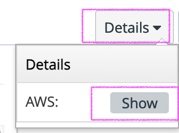
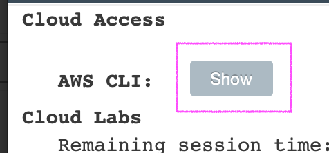
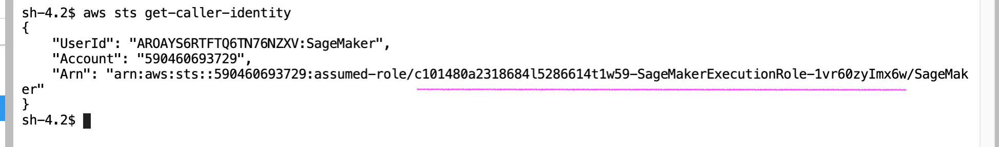
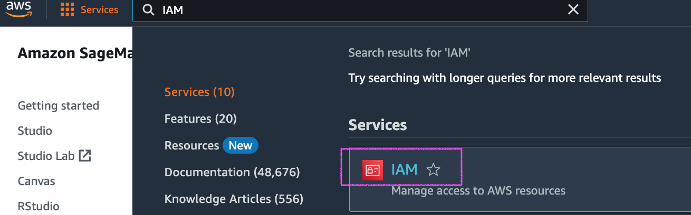
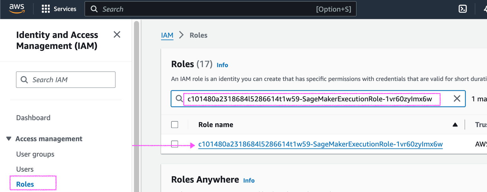
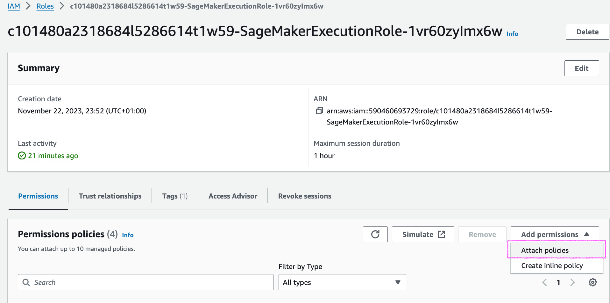
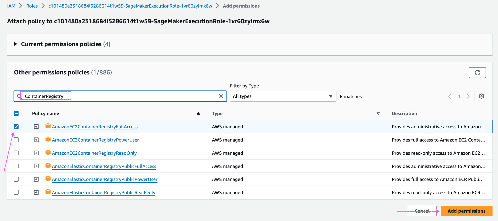

# 2023-24-UFS14-ML

## Install AWS CLI

The following steps are required only if the AWS CLI is not installed/configured.
See "Verify AWS CLI is working" to check if AWS CLI is installed/configured.

```
_pwd=$PWD
cd /opt
curl "https://awscli.amazonaws.com/awscli-exe-linux-x86_64.zip" -o "awscliv2.zip"
unzip awscliv2.zip
sudo ./aws/install
cd $_pwd
```

### AWS CLI configuration files

`code ~/.aws/credentials`

with the content you obtained from the Sandbox




`code ~/.aws/config`

with the content below

```
[default]
region = us-east-1
```

## Verify AWS CLI is working

`aws --version`

must return something like "aws-cli/2....."

`aws configure get region`

must return something like "us-east-1"

`aws sts get-caller-identity`

must return a JSON containing the details of you AWS console account

## Docker login for AWS ECR

`aws ecr get-login-password --region {ECR region} | docker login --username AWS --password-stdin {ECR image URI}`

eg.

`aws ecr get-login-password --region us-east-1 | docker login --username AWS --password-stdin 763104351884.dkr.ecr.us-east-1.amazonaws.com/pytorch-training:1.5.0-cpu-py3`

### docker-compose

In this demo you'll find a docker-compose.yml example that build and run a customized container using a SageMaker Docker base image.

You can use `docker-compose up --build` to build&run the example.

## AWS ECR IAM policies

Some times your AWS CLI user need to be attached to a specified IAM policy to be able to push Docker images to ECR.

To do that first you need to retrieve the current AWS CLI user with the following command

`aws sts get-caller-identity`



Then you need to open IAM and...






... profit!
